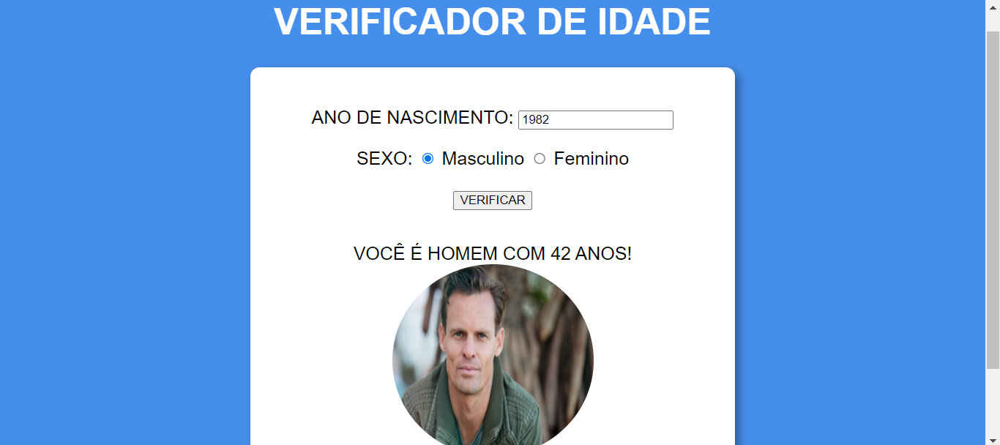

# VERIFICADOR DE IDADE
👨‍🏫PROJETO FEITO PARA O CURSO DE JAVASCRIPT DO CURSO EM VIDEO.

  

## DESCRIÇÃO:
O "Verificador de Idade" é uma aplicação simples que permite aos usuários verificar sua idade com base no ano de nascimento fornecido e selecionar seu sexo. Este aplicativo é uma ferramenta simples para determinar a idade e proporciona uma experiência interativa ao exibir uma imagem correspondente ao sexo e à faixa etária do usuário. Aqui estão os principais recursos do aplicativo:

- **Entrada de Dados:**
  - O usuário pode inserir o ano de nascimento no campo de entrada fornecido.
  - O usuário pode selecionar seu sexo marcando uma das opções fornecidas: masculino ou feminino.

- **Verificação de Idade:**
  - Ao clicar no botão "VERIFICAR", o aplicativo calcula a idade do usuário com base no ano de nascimento fornecido e no ano atual.
  - Se os dados inseridos forem inválidos (como um ano de nascimento futuro ou campo vazio), uma mensagem de erro será exibida.

- **Exibição do Resultado:**
  - Após a verificação bem-sucedida, o aplicativo exibe uma mensagem indicando o sexo e a idade do usuário.
  - Uma imagem correspondente ao sexo e à faixa etária do usuário também é exibida ao lado da mensagem.

## EXECUTANDO O APLICATIVO:
1. Abra o arquivo `CODIGO.html` em um navegador da web.
2. Insira o ano de nascimento no campo fornecido.
3. Selecione o sexo marcando a opção correspondente.
4. Clique no botão "VERIFICAR" para calcular a idade e exibir o resultado.
5. Observe a mensagem indicando o sexo e a idade do usuário, juntamente com uma imagem correspondente.

## NÃO SABE?
- Entendemos que para manipular arquivos em `HTML`, `CSS` e outras linguagens relacionadas, é necessário possuir conhecimento nessas áreas. Para auxiliar nesse aprendizado, oferecemos cursos gratuitos disponíveis:
* [CURSO DE HTML E CSS](https://github.com/VILHALVA/CURSO-DE-HTML-E-CSS)
* [CURSO DE JAVASCRIPT](https://github.com/VILHALVA/CURSO-DE-JAVASCRIPT)
* [CONFIRA MAIS CURSOS](https://github.com/VILHALVA?tab=repositories&q=+topic:CURSO)

## CREDITOS:
- [PROJETO FEITO PELO VILHALVA](https://github.com/VILHALVA)
- [PROJETO FEITO PARA O CURSO DE JAVASCRIPT](https://github.com/VILHALVA/CURSO-DE-JAVASCRIPT)
- [ESTÁ DISPONIVEL NO SITE](https://vilhalva.github.io/STYLER/STYLER.html)